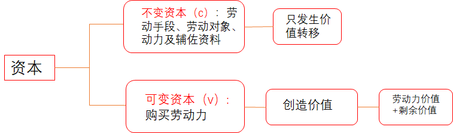
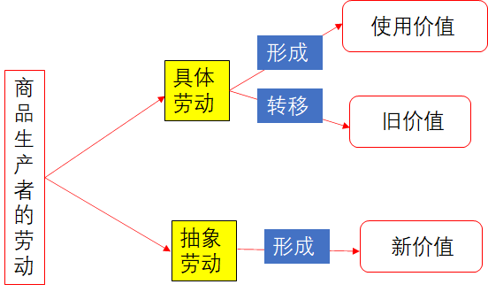

# 第四章 资本主义的本质及规律

## 学习目标

运用马克思主义的立场观点，准确认识资本主义生产方式的基本矛盾，理解资本主义制度的本质，认识和把握资本主义政治制度和意识形态

## 学习要点

1.劳动价值论及其意义

2.剩余价值论及其意义

## 第一节 商品经济和价值规律（劳动价值论）

**商品：**用来**交换**、能满足人的某种需要的**劳动产品**
$$
劳动价值论\begin{cases}
           1.商品二因素  & \text{} \\
           2.劳动二重性  & \text{} \\
           3.商品价值量  & \text{} \\
           4.价值规律   & \text{} \\
           5.商品经济基本矛盾
           
        \end{cases}
$$

### 一、商品二因素

**商品二因素：使用价值和价值**

#### （一）使用价值

**1.定义：**是指商品能够人们某种需要的有用性，是商品的某种属性

2.使用价值反映**人与自然**之间的物质关系，是商品的**自然属性**

3.商品的**使用价值**不是用来满足生产者自身需要的，而是通过交换来满足**别人需要**的

#### （二）价值（区分哲学上的价值与经济学上的价值）

**1.定义：**价值是凝结在商品中的**无差别的一般人类劳动**，即人的脑力和体力的消耗

2.**价值**之间在**质**上是相同的，只有**量**上的差别，它们可以互相比较。

3.**价值**是商品所特有的**社会属性**，他在本质上体现了**生产者之间一定的社会关系**。

**一元劳动价值论：劳动是价值创造的唯一源泉（重点）**

#### （三）交换价值（不是商品的二因素）

1.**交换价值**表现为一种使用价值同另一种使用价值相交换的**量的关系**或比例关系。

#### （四）使用价值和价值对立统一的关系

**1.对立性：**商品的使用价值和价值是相互排斥的，二者不可兼得。

**2.统一性：使用价值是价值的物质承担者，价值寓于使用价值之中。**一种物品如果没有使用价值，即使人们为它付出了大量劳动，**也没有价值**（卖不出去，实现不了商品的价值）。一种物品尽管具有使用价值，但如果不是劳动产品，**也没有价值**（没有凝结劳动）

### 二、劳动的二重性

**劳动的二重性：具体劳动、抽象劳动**

#### （一）具体劳动

**1.定义：**生产一定**使用价值**的**具体形式**的劳动。具体劳动过程是人们**利用和改造自然物质**，使之适合人们需要的过程，它反映的是**人与自然**之间的关系

2.生产商品的具体劳动创造商品的**使用价值**

#### （二）抽象劳动

**1.定义：**撇开了具体形式的、无差别的一般人类劳动，即人的脑力和体力的耗费。

2.**抽象劳动**形成商品的**价值**，它反映的是**人与人**之间的关系

#### （三）劳动的二重性决定了商品的二因素

$$
劳动的二重性\begin{cases}
           			& \text{（劳动的具体形式）} \\
           具体劳动  & \text{——————>  使用价值} \\
           		    & \text{（无差别人类劳动）} \\
           抽象劳动  & \text{——————>   价值} \\
           
        \end{cases}
\left.
\begin{matrix}
\\
\\
\\
\end{matrix}
\right\}
商品的二因素
$$

#### （四）具体劳动和抽象劳动的对立统一的关系

1.具体劳动和抽象劳动**是统一的**。它们是**同一劳动的两种规定**，不是独立存在的两种劳动，也不是两次劳动，是同一劳动过程
不可分割的两个方面。

2.具体劳动和抽象劳动又**是有差别的**。反映劳动的不同属性，**具体劳动**反映人与自然的关系，是劳动的**自然属性**，而**抽象劳动**反映商品生产者的社会关系，是劳动的**社会属性**；**抽象劳动**在质上是相同的，只存在量的差别

### 三、商品的价值量

#### （一）商品价值量与社会必要劳动时间的关系

$$
价值\begin{cases}
           价值的质  & \text{} \\
           价值量<—— 劳动量<——劳动时间<——社会必要劳动时间 & \text{} \\
          
           
        \end{cases}
$$

**1.社会必要劳动时间：**在现有的社会**正常**的生产条件下，在社会**平均**的劳动熟练程度和劳动强度下制造某种商品所需要的劳动时间

**2.社会必要劳动时间决定商品价值量**

#### （二）商品价值量与劳动生产率的关系

**1.劳动生产率：**是劳动者生产商品的效率，单位时间里生产商品的数量

2.劳动生产效率越高，单位时间里生产的商品数量越多，生产每件商品所需要的社会必要劳动时间就越少，单位商品的价值量就越小。**商品的价值量与生产商品的劳动时间成正比，与劳动生产率成反比**

3.影响劳动生产率的因素很多：劳动、**科技**、管理、资本、土地等因素

#### （三）商品价值量与劳动复杂程度的关系

1.以**简单劳动**为尺度计量商品价值量。复杂劳动等于自乘**多倍**的简单劳动，少量的复杂劳动等于多量的简单劳动（劳动转化）

2.相同的时间，复杂劳动创造的价值**大于**简单劳动创造的价值。**复杂劳动转化为简单劳动**，是在商品交换过程中自发实现的

#### （四）价值形式的发展和货币的产生

1.货币具有价值尺度、流通尺度、贮藏手段、支付手段和世界货币等职能

2.货币是固定充当一般等价物的商品

3.一切商品只要转换成货币，商品使用价值和价值的矛盾就能得到解决，从而使商品的价值得到实现

**“商品的惊险跳跃”——商品的交换**

### 四、价值规律

#### （一）价值规律的内容

商品的价值量由生产商品的社会必要劳动时间决定；商品交换以价值量为基础；按照等价交换的原则进行

#### （二）价值规律的表现形式

商品的**价格围绕商品的价值上下波动**。受供求关系影响，商品价格有时高于价值，有时低于价值，围绕价值这个中心上下波动；
**从长时间看**，价格高于价值的部分和价格低于价值的部分能够相抵，商品的**平均价格和价值相一致**。

#### （三）价值规律的作用

价值规律有利也有弊

### 五、商品经济基本矛盾

**商品经济基本矛盾：私人劳动和社会劳动的矛盾**

#### （一）社会劳动

**社会分工**决定了商品生产者的劳动具有社会性质。每个生产者在社会分工体系中从事的是某一种商品的生产，生产者之间相互联系、**彼此交换**，每个生产者的劳动都是社会总劳动的一部分，是具有社会性质的社会劳动

#### （二）私人劳动

生产资料**私有制**决定了商品生产者的劳动具有私人性质。由于生产资料私有制的存在，每个生产者独立进行生产，拥有生产出来的产品，自负盈亏。生产者按照自己的利益和要求进行劳动，是具有私人性质的私人劳动

#### （三）私人劳动与社会劳动的矛盾是私有制商品经济的基本矛盾

1.决定着**商品经济的本质**及发展过程。

2.是**商品经济其他一切矛盾**的基础

3.决定着**商品生产者的命运**

### 六、深刻认识马克思劳动价值论

#### (一)马克思劳动价值论的理论和实践意义

1.扬弃了**英国古典政治经济学**的观点，**创立了劳动二重性理论**，阐明具体劳动和抽象劳动在商品价值形成中的不同作用。**劳动二重性理论是理解政治经济学的<u>枢纽</u>**

2.揭示了**私有制条件下商品经济的基本矛盾**，为从**物与物的关系**揭示背后**人与人的关系**提供了理论依据。

3.揭示了**商品经济的一般规律**，为社会主义市场经济发展提供了理论指导。

**注：**1.**亚当·斯密**提出劳动价值论的观点

​		2.**大卫·李嘉图**提出商品价值量由社会必要劳动量决定的学说

​		3.**马克思**开创了“劳动二重性”学说

#### （二）深化对马克思劳动价值论的认识

1.深化对创造价值的劳动的认识，对**生产性劳动**作出新的界定，指资本主义条件下，只有**创造剩余价值**的劳动才是生产性劳动

2.深化对科技人员、管理人员在社会生产和价值创造中的认识。**“总体工人”认为脑力劳动也创造价值，强调体力劳动、脑力劳动都创造价值**

3.深化对**价值创造与价值分配**关系的认识

## 第二节 资本主义经济制度（剩余价值论）

$$
剩余价值论\begin{cases}
           1.劳动力成为商品  & \text{} \\
           2.货币转化为资本  & \text{} \\
           3.剩余价值的生产  & \text{} \\
           4.资本积累   & \text{} \\
           5.资本循环   & \text{} \\
           6.资本周转   & \text{} \\
           7.工资与剩余价值分配
           
        \end{cases}
$$

### 剩余价值论的意义

**1.**马克思**创立了**剩余价值理论

**2.**揭露了资本主义生产关系的**剥削本质**

**3.**阐明了资产阶级与无产阶级之间阶级斗争的**经济根源**

4.是马克思主义经济理论的**基石**

### 一、劳动力成为商品

#### （一）劳动力成为商品的基本条件

**基本条件：**

1.劳动者在法律上是自由人，能够把自己的劳动力当做自己的商品来支配：

2.劳动者没有任何生产资料，没有生活资料来源，因而不得不依靠出卖劳动力为生。

**劳动力：**是指人的劳动能力，是人的体力和脑力的总和。

**劳动力的使用——劳动**

#### （二）劳动力商品的特点

**1.劳动力商品的价值：**是由生产、发展、维持和延续劳动力所必需的生活必需品的价值所决定的

**2.为什么强调劳动力商品很廉价？**

—是维持劳动者**本人**生存所必需的生活资料的价值；
二是维持劳动者**家属**生存所必需的生活资料的价值；
三是劳动者接受**教育和训练**所支出的费用；

3.劳动力商品的价值是由生产生活必需品的**社会必要劳动时间**决定

**4.劳动力商品的突出特点：**在于**它的使用价值是价值的源泉**，它在使用过程中能创造**新的价值**，而且这个新的价值**比劳动力价值**本身更大，包括劳动力价值、剩余价值（价值增值）

注：**劳动者在劳动中创造的价值=劳动力价值（工资）+剩余价值**

### 二、货币转化为资本：用货币来生产剩余价值

#### （一）资本

1.定义：能够**生产剩余价值**的**价值**，反映了资本家和工人之间剥削和被剥削的关系。

2.用货币购买劳动力商品，劳动力的使用带来**剩余价值**，**货币就变成了资本**

3.马克思的分析揭示了剩余价值的真正来源，阐明了**资本的本质**。

**4.劳动力成为商品是货币转化为资本的前提（重点）**

#### （二）资本的本质

1.资本是可以带来**剩余价值**的**价值**

2.资本总是通过各种**物**表现出来

3.资本的本质不是**物**，而是体现在物上的**资产阶级的生产关系**，即雇佣劳动关系。

### 三、剩余价值的产生

**生产剩余价值是资本主义生产方式的绝对规律**

#### （一）资本主义生产过程具有二重性

**1.生产物质资料的劳动过程：**

 **生产物质资料的过程包括三个基本要素：**劳动者的劳动、劳动对象和劳动资料

**资本主义劳动过程的两个特点：** 

1.工人在资本家的监督下劳动，他们的劳动隶属于资本家； 

2.劳动的成果或者产品全部归资本家所有

**2.生产剩余价值的过程，即价值增殖过程（资本主义生产过程的主要方面）**

**价值增殖过程**：超过劳动力价值的补偿这个一定点而延长了的价值形成过程； 

**雇佣工人的劳动分为两部分：必要劳动：**用于再生产劳动力的价值；**剩余劳动：**用于无偿地为资本家生产剩余价值

**工人的剩余劳动是剩余价值的源泉。**剩余价值的**本质**是雇佣工人创造的并被**资本家无偿占有**的超过劳动力价值的那部分价值，体现了资本家对雇佣工人的**剥削关系**

#### （二）资本的划分

**资本主义商品的价值构成公式：**

**W=c（不变资本）+v（可变资本）+m（剩余价值）=转移价值+劳动力价值+剩余价值**

**1.不变资本（c）**:是以**生产资料**形态存在的资本

生产资料的价值通过**具体劳动**转移到新产品中，转移的价值量**不会大于**它原有的价值量。有的是一次性转移（原材料、燃料；有的是多次转移（机器、厂房）。在生产中**只转移价值、不增值价值**。

**2.可变资本（v）**:购买劳动力的那部分资本（工资）

可变资本的价值不是被转移到新产品中，而是由工人劳动创造出来。**工人创造的新价值，不仅包括劳动力价值，还包括剩余价值**

**（创造的新价值=劳动力价值+剩余价值）**

**补充：转移价值**

**转移价值**：工人通过具体劳动，改变生产资料的具体形态，产生具有使用价值、满足人们需要的商品，在生产过程中生产资料的价值存在消耗，它们的价值转移到产品中，构成最终商品价值的一部分。

——具体劳动不仅形成商品的使用价值，同时转移生产资料的价值

——（**w=c+v+m**）商品价值=转移的生产资料价值+劳动者创造的**新价值**

#### （三）划分不变资本和可变资本的重要意义

1.揭示了**剩余价值（m）的源泉**。剩余价值是由**可变资本**雇佣的劳动者创造的。劳动者的**剩余劳动**是剩余价值的唯一源泉。

2.为考察资本家对雇佣工人的**剥削程度**提供科学依据。拿剩余价值和雇佣劳动者的可变资本相比

**（剩余价值率=m/v=剩余价值/可变资本=剩余劳动/必要劳动=剩余劳动时间/必要劳动时间=无偿占有/付了工资）**

#### （四）剩余价值生产的两种基本方式

**两种基本方式：绝对剩余价值和相对剩余价值**

**1.绝对剩余价值**：指在必要劳动时间不变的条件下，由于延长工作日的长度或提高劳动强度而产生的剩余价值

**2.相对剩余价值：**是指在工作日长度不变的条件下，通过缩短必要劳动时间而相对延长剩余劳动时间所产生的剩余价值

**3.如何缩短必要劳动时间？**

通过**全社会劳动生产率提高**来实现的。因为提高了整个社会的劳动生产率，**降低了生活必需品的价值**，降低了劳动力价值，从而缩短了必要劳动时间，相对延长了剩余劳动时间。

#### （五）超额剩余价值的生产

**全社会劳动生产率的提高是资本家追逐超额剩余价值的结果**

**1.超额剩余价值：**是指产业由于提高劳动生产率而使商品的个别价值低于社会价值的差额。

**2.超额剩余价值的产生：个别企业提高自己的劳动生产率**，使商品的个别价值低于社会价值的差额。每个资本家都提高劳动生产率，使其商品的**个别劳动时间少于社会必要劳动时间**，个别价值低于社会价值，从而获得超额剩余价值。

**3.个别企业先获得超额剩余价值，然后整个资本家阶级才获得相对剩余价值**

### 四、资本的积累

#### （一）资本积累

**1.定义：**把剩余价值转化为资本，或者说，剩余价值的资本化。

——用剩余价值来生产剩余价值。

**2.资本主义简单再生产：**资本家瓜分到剩余价值后，将其完全用于**个人消费**，生产就在**原有规模**上重复进行。**实质**是物质资料再生产和资本主义生产关系再生产的统一。

**3.资本主义扩大再生产：**是指资本家不是把剩余价值全部用于个人消费，而是将一部分转化为资本，用来购买追加的生产资料和劳动力，使生产在**扩大的规模**上重复进行。**资本积累是资本主义扩大再生产的源泉**。资本家用从雇佣工人那里剥削得来的剩余价值，再来购买工人的劳动力，进行更大规模的生产，以榨取更多的剩余价值。

**4.资本积累的本质：**资本家利用无偿占有的工人创造的**剩余价值**来扩大自己的资本规模，进一步扩大和**加强对工人的剥削**。

#### （二）资本积累导致社会失业：资本有机构成和相对人口过剩

**1.资本的技术构成：**由生产技术水平决定的生产资料和劳动力之间的比例

**2.资本的价值构成：不变资本和可变资本之间的比例（c/v）**

**3.资本的有机构成：**由资本的技术构成所决定、并反映技术构成变化的资本价值构成

**4.资本有机构成不断提高会导致什么后果？**
       资本主义生产的唯一动机和直接目的是追求剩余价值。为此，资本家便尽可能改进技术，加快资本积累，扩大生产规模。生产技术水平不断提高，**每个劳动力所推动的生产资料的数量大幅度增加**，从而资本有机构成得以不断得高，可变资本的相对量减少，**资本对劳动力的需求也相对减少了**，造成大批工人**失业**，形成相对过剩人口。

**5.相对过剩人口**：劳动力供给超过了资本对的需要。这种过剩人口之所以是相对的，是因为**它并不是社会生产发展所绝对不需要的，而是由于他们不为资本价值增殖所需要**，使他们成为“过剩”的或 “多余”的人了。

### 五、工资的本质

#### （一）工资的本质和假象

**1.工资的本质：**资本家以货币的形式购买工人的劳动力（**劳动力的价值或价格**）

**2.工资的假象：**资本家付给工人工资，工人为资本家劳动（**劳动的价值或价格**）

#### （二）工资的形式和变化

**1.工资的形式：**计时工资和计件工资

**2.工资的变化：工人的工资不断提高**，但与其创造的剩余价值的增长幅度相比，工资的提高幅度是比较小的。只要资本主义雇佣劳动关系不变，**资本主义工资的本质就不会发生根本变化**

### 六、资本主义的基本矛盾与经济危机

#### （一）资本主义的基本矛盾

**1.基本矛盾：生产社会化和生产资料资本主义私人占有之间的矛盾**

**2.生产社会化（生产力的社会化）:**强调劳动资料、劳动者、劳动产品的社会化；“社会化的大生产”强调机器和大工业的生产。

**3.生产资料私有占有：**生产资料由资本家占有；工人的劳动受资本家的监督和控制；剩余价值被资本家占有。

**这是生产力与生产关系之间矛盾在资本主义社会的具体表现**

#### （二）资本主义经济危机

**1.本质特征：生产过剩**，大量商品积压。**相对过剩**是相对于劳动者的<u>支付能力</u>来说的，不是与劳动者的<u>需要</u>来说的

**2.根本原因：资本主义的基本矛盾。**生产社会化会导致商品生产无限扩大，但是生产资料资本主义私有制会导致劳动者的支付能力缩小

**3.主要特点：**经济危机具有**周期性**

