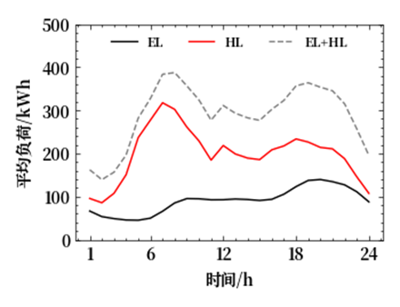

# 第一个要解决的设计优化问题

## 1.基本信息

### 地点：

新疆哈密
气象数据

### 系统：

离网系统：不连接电网

系统组件：
电源：光伏
热源：热泵
氢能：电解水制氢+储氢罐+燃料电池发电

[系统结构参考文献 ](https://www.wolai.com/6DDLR3UZQMS1M4bK2tctXg)

在此基础上，增加热泵用于提供热负荷

[热泵COP计算](https://www.wolai.com/efiXSi9XbcmhtkPWavNq4r)
负荷：某小区的热/电负荷

年度总电负荷EL：794.13 MWh
年度总热负荷HL：1749.26 MWh

[小时负荷（kWh）文件](../assets/Optimization/weather_Hami.csv)

    

## 2.能源系统建模

### 系统设计

描述负荷场景，能源系统结构与运行方式

### 组件模型

详细介绍各组件的计算模型

## 3.优化问题建模

优化问题概述，并使用数学语言描述优化问题

### 优化变量

变量名称，类型，变量域

### 优化目标

优化目标函数计算方法

### 约束条件

能量守恒、物理设备约束等

